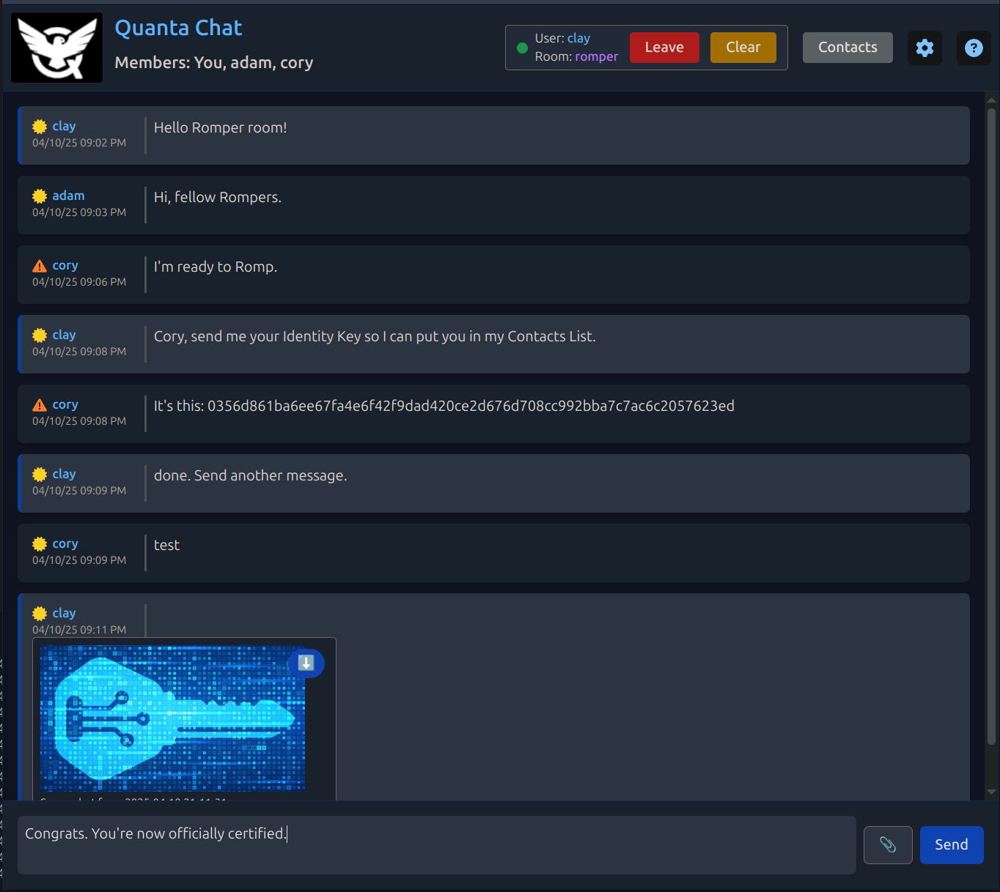
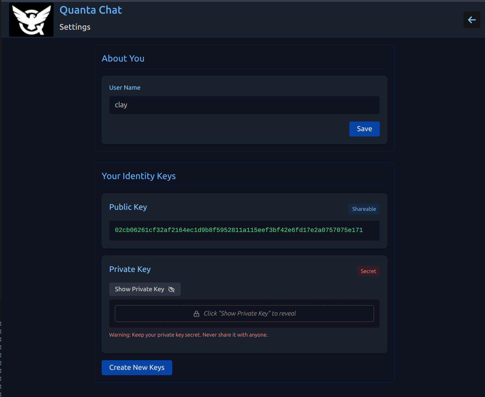
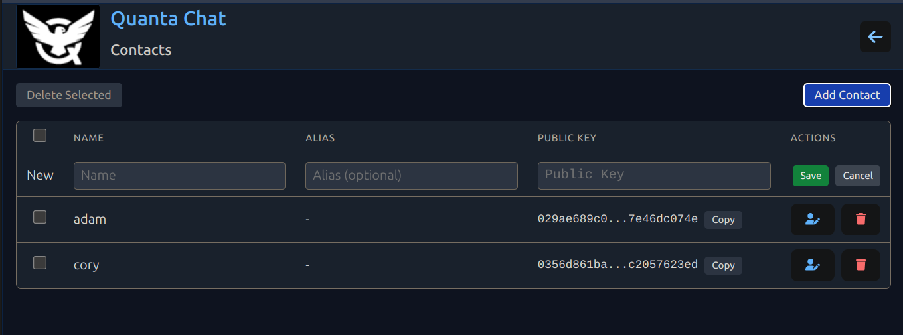

# Quanta Chat User Guide

## About Quanta Chat

Quanta Chat is a P2P (Peer-to-Peer) messaging app that allows browsers to send messages directly to each other without going thru a master server. This means there's no central storage for the chat messages, and file attachments, becasue all that information is kept in browser local storage instead. There's essentially no setup or configuration required, you can just enter a room name, and start chatting with people in that room. Rooms are created as needed, and no one "owns" or controls any rooms.

## Joining a Chat Room

To join a chat room, simply enter the room name in the input field (and currently you need a username as well) and click the "Join" button. You will be taken to the chat room where you can start chatting with other users. Rooms are created on demand, and no one "owns" any room. If you want a private room for you and your friends, just create a room with a unique name.

## Sending Messages

To send a message, simply type your message in the input field and press the "Send" button. Your message will go out in realtime to all other users who are in the same room. You can also use markdown syntax to format your messages. The attachment button is fairly standard and works the same as in other web apps, where you can pick files from your computer and they will get attached to a chat message along with the chat text.

*Note: Markdown formatting is supported for chat messages*

## Leaving a Room

To leave a room, simply click the "Leave" button. You will be taken back to the main screen where you can join another room or create a new one.

## Enable Signatures

You can enable message signatures by clicking the "Settings" button. This will let you create an Identity Key that represents your identity, which the app will then automatically start using to sign all messages you send out. This is a great way to ensure that your messages are authentic and have not been tampered with, and that messages really come from you. Similar to other decentralized or Peer-to-Peer apps (like Nostr for example), your identity is considered to be your public key, and your messages are signed with your private key. In fact since Quanta Chat uses the same security algorithms as Nostr, your Quanta Chat key will be a valid Nostr key, even if you're not using Nostr. 

## Contact List

If you want to verify that messages you receive are from a specific person, you can add them to your contacts list. This will allow you to set their public key, that you'll get from them, however you want to get it, and once you've assigned their public key in your Contact List entry all messages you get from that person will be automatically authenticated using a cryptographic signature. You can also add a nickname for them, so you can easily identify them in the chat room. Any time a message is displayed, the authenticity is always checked via cryptographic signature, and if the sender is not in your contacts list, you will see a warning icon next to their name, or else you will see a green checkmark.

