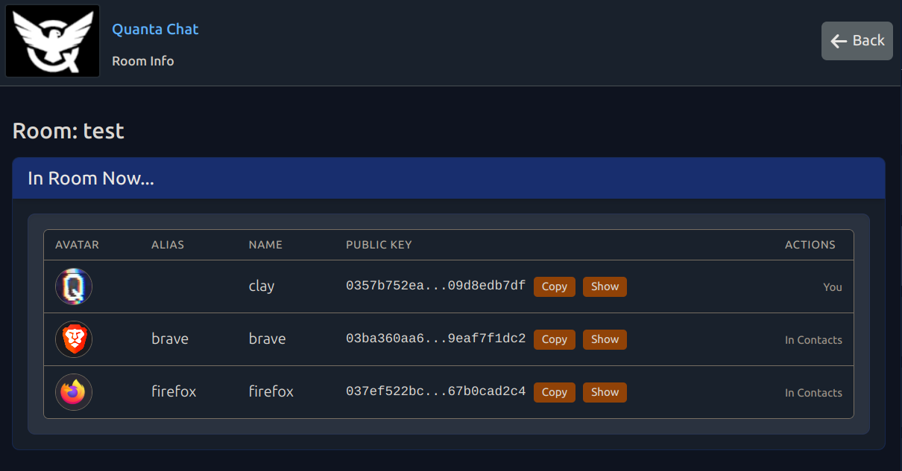

# Quanta Chat User Guide

## About Quanta Chat

For an overview of this app refer to the [README.md File](https://github.com/Clay-Ferguson/quanta-chat/blob/main/README.md). Here's what the main chat view looks like.

## Joining a Chat Room

To join a chat room, simply enter the room name in the input field and click the "Join" button. You will be taken to the chat room where you can start chatting with other users that are in that room. Rooms are created on demand, and no one "owns" any room. If you want a private room for you and your friends, just create a room with a unique name and keep the name secret.

If you have the "Save to Server" option enabled then you're in non-P2P mode and you can post messages to the room which will be saved on the server, so that when other users join the room they'll see all those messages. If you're in P2P mode, you can only send to people who are online live with you at the same time. 

## Sending Messages

To send a message, simply type your message in the input field and press the "Send" button. Your message will go out in realtime to all other users who are in the same room. You can also use markdown syntax to format your messages. The attachment button is fairly standard and works the same as in other web apps, where you can pick files from your device and they will get attached to a chat message along with the chat text.

*Note: Markdown formatting is supported for chat messages*

## Leaving a Room

To leave a room, simply click the "Leave" button. You will be taken back to the main screen where you can join another room or create a room.

## Your Identity

If you're not familiar with `Public Key` stuff don't worry you can ignore this section. The app does everything automatically, but for more technical users, this section will be helpful.

Your unique identity is represented by your Public Key (a Cryptographic Key), which the app will automatically create for you and use to sign all messages you post. If you don't know much about cryptographic communications, all this means is that it's impossible for anyone to impersonate you, while also ensuring that your messages are authentic and have not been tampered with. 

So there can be any number of users who choose to use "Jack" as their username, and that's fine, there's no system enforcing user name uniqueness, so if you want to be sure you're talking to the person you know as "Jack" all you need to do is add their Public Key to your Contacts List, and automatically their posts alway show up with a "Gold Certificate" icon so you can be sure it's from from who you think it is, and all this can be done, without a central server.

Similar to other decentralized or Peer-to-Peer apps (like Nostr for example), your identity is considered to be your public key, and your messages are signed with your private key. In fact since Quanta Chat uses the same security algorithms as Nostr, your Quanta Chat key will be a valid Nostr key, even if you're not using Nostr. 

## Key Management

You can import a Key Pair simply by entering your Private Key, or generate a new Key Pair.

## Contact List

As mentioned already, if you want to verify that messages you receive are from a specific person, you can add them to your contacts list.  You can also add a nickname for them, so you can easily identify them in the chat room, by your own nickname. Any time a message is displayed, the authenticity is always checked via cryptographic signature, and if the sender is not in your contacts list, you will see a warning icon next to their name, just meaning you may not know them.

## Avatars

Each user can upload an Avatar image, set their User Name, and Description in their settings page. Then other users can always click that avatar image, wherever it appears, to display this information.

## Your Room History 

You can view the rooms you've visited before using the "Rooms" button.

## Room's Current Members

You can view who's in your current room using the "Info" button.

